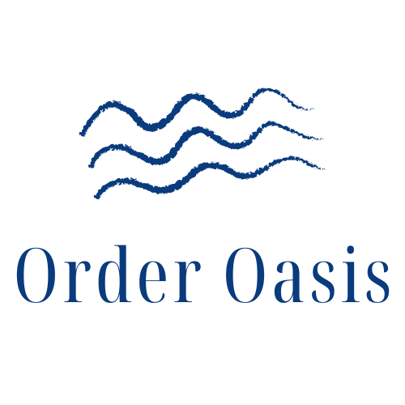
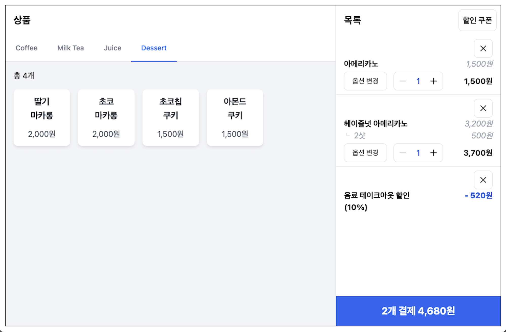
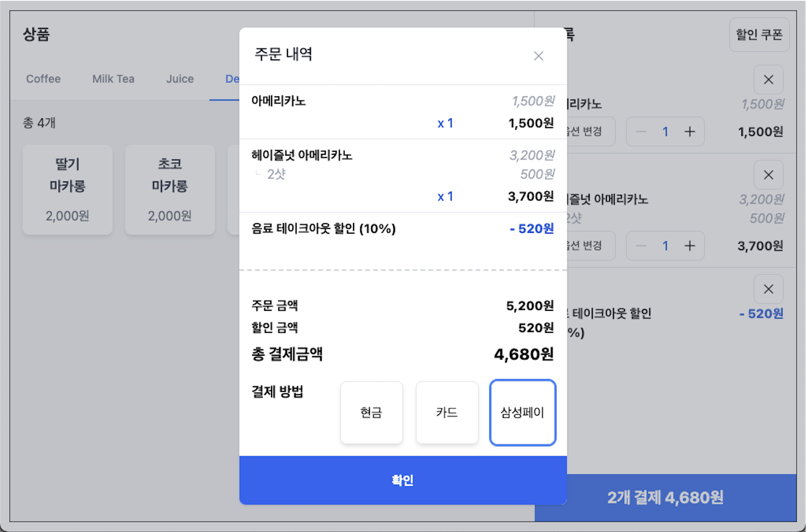

# Order Oasis
<div align="center">
    
</div>

**Order Oasis**는 카페와 음식점에서 주문 처리를 지원하는 포스(POS) 서비스입니다.
<br />
데스크탑과 태블릿에서 모두 사용할 수 있어 바쁜 음식점에서도 주문을 효율적으로 관리하고 처리할 수 있습니다.
<br />
현재는 사용자 인터페이스와 클라이언트 로직이 완성되어 있으며, 결제 연동은 테스트용 데이터로만 작동합니다.

## 목차

- [프로젝트 개요](#프로젝트-개요)
    - [기술 스택](#기술-스택)
    - [디렉토리 구조](#디렉토리-구조)
- [실행](#실행)
- [실시간 데모](#실시간-데모)
- [기능](#기능)
    - [주문 관리](#1-주문-관리)
    - [결제 시뮬레이션](#2-결제-시뮬레이션)
    - [다양한 화면 크기 대응](#3-다양한-화면-크기-대응)
    - [사용자 경험 개선](#4-사용자-경험-개선)
- [고려 사항](#고려-사항)
    - [사용자 경험](#1-사용자경험)
    - [퍼포먼스](#2-퍼포먼스)
    - [프로덕트](#3-프로덕트)
    - [협업/유지보수](#4-협업유지보수)


## 프로젝트 개요

### 기술 스택
- React.js
- TypeScript
- tailwind CSS

### 디렉토리 구조
```
.
├── public
│   └── assets
│       └── icons
└── src
    ├── components  # 재사용 가능한 컴포넌트 저장
    ├── helper      # 프로젝트 전역에서 사용되는 계산 함수
    ├── service     # api 연동 로직
    ├── store       # 상태관리 및 비즈니스 로직
    │   ├── modal
    │   ├── order
    │   └── pos
    ├── type        # 커스텀한 유틸리티 타입
    └── views
        └── pos
            ├── menu
            ├── modal
            └── orderPreview 
```


## 실행

```
npm install
npm run start
```





### 실시간 데모
이 프로젝트는 Vercel을 통해 배포되었습니다. 아래 링크를 통해 프로젝트를 확인할 수 있습니다.  
[https://order-oasis.vercel.app/](https://order-oasis.vercel.app/)


## 기능

### 1. 주문 관리
- 주문 추가, 수정, 삭제 기능을 제공하여 음식점이 주문을 효율적으로 관리할 수 있습니다.
- 주문 상태를 실시간으로 업데이트하여 바쁜 시간에도 주문을 관리할 수 있습니다.

### 2. 결제 시뮬레이션
- 결제 연동 부분이 아직 구현되지 않았지만, 테스트용 데이터를 사용하여 결제 시뮬레이션을 제공합니다.
- 실제 결제 연동 전에 시스템을 테스트하고 사용자 경험을 확인할 수 있습니다.

### 3. 다양한 화면 크기 대응
- 반응형 디자인을 통해 다양한 화면 크기에 대응하여 사용자가 어떤 기기에서든 편리하게 사용할 수 있습니다.

### 4. 사용자 경험 개선
- UI/UX를 고려하여 모달 중심의 UI와 최신 모바일 주문앱에 가까운 조작 방식을 적용하여 사용자 경험을 개선했습니다.


## 고려 사항

### 1. 사용자경험
POS는 업무용 도구이고, 사용자는 밀려드는 주문을 빠르게 처리해야 하는 작업자입니다.  
시각적 화려함보다 명확한 시인성과 민첩한 반응성이 더 중요하다고 판단했습니다.

이를 `모달 중심의 UI`, `터치 수를 최소화한 UX`, `기존 버튼식 POS보다 최신 모바일 주문앱에 가까운 조작 방식`으로써 구현하였습니다.

- 메뉴와 옵션이 같은 주문을 병합
- 주문 추가된 순서 유지
    - 옵션 변경으로 인한 주문수량 취합 or 새로운 주문 생성시 기존 순서가 유지되도록 함

- 수량조절 버튼
    - 주문 아이템을 클릭했을 때, 수량조절/삭제 버튼이 나타나게 할지 고민했으나
    - 빠르게 일하는 상황에 즉시 조작할 수 있도록 상시 노출
- 주문 수량 1일 때 마이너스 버튼 비활성화
    - 실수로 인한 삭제 방지

- 적용된 쿠폰 위치
    - 적용된 쿠폰은 항상 맨 아래에 위치함으로써 주문과 분리
- 상품금액을 초과하는 할인금액 허용
    - 사용자가 원하는 방향으로 사용할 수 있게 유연하게 제공
    - 이 경우, 결제 최소금액은 0원
- 결제완료 Notification 스킵 후 홈화면으로 이동
    - 빠르게 다음 주문을 처리하는 게 중요하다고 생각함

### 2. 퍼포먼스
- 모달 context 분리하여 렌더링 최적화
- 컴포넌트 재사용

### 3. 프로덕트
- 다양한 크기의 디바이스에 대응할 수 있도록 css 개발
- 쿠폰 추가 (특정 카테고리 아이템에만 적용되는 쿠폰 추가)
    - 음료 테이크아웃 할인: coffee, milktea, juice에만 적용
    - \[18시~\]푸드 마감 세일: dessert에만 적용

### 4. 협업/유지보수
- 상태관리를 하는 store와 화면 그리는 views 분리
- api 호출부를 비즈니스 로직에서 분리
- 계산로직을 helper 함수로 분리하여, 항상 같은 계산식으로 결과값이 나오게 함
- 포스에서 기본적으로 사용하는 데이터는 Pos hook에서 상태관리 / 주문에 사용되는 데이터는 Order hook에서 관리
    - 포스에서 계속 사용될 데이터와 주문 마다 커스텀/갱신되어야 할 데이터를 분리하여 코드 품질 업
- Provider Wrapper 컴포넌트를 두어 App 컴포넌트와 분리


<br />
<br />
<br />

<div align="right">
    <a href="https://hits.seeyoufarm.com">
        
    </a>
</div>
